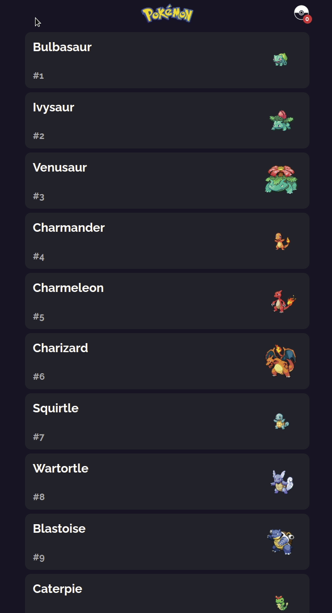

<!--
*** Thanks for checking out the Best-README-Template. If you have a suggestion
*** that would make this better, please fork the repo and create a pull request
*** or simply open an issue with the tag "enhancement".
*** Thanks again! Now go create something AMAZING! :D
***
***
***
*** To avoid retyping too much info. Do a search and replace for the following:
*** fyfirman, pacis-questionnaire-bot, twitter_handle, fyfirman@gmail.com, project_title, project_description
-->

<!-- PROJECT SHIELDS -->
<!--
*** I'm using markdown "reference style" links for readability.
*** Reference links are enclosed in brackets [ ] instead of parentheses ( ).
*** See the bottom of this document for the declaration of the reference variables
*** for contributors-url, forks-url, etc. This is an optional, concise syntax you may use.
*** https://www.markdownguide.org/basic-syntax/#reference-style-links
-->

[![LinkedIn][linkedin-shield]][linkedin-url]

<!-- PROJECT LOGO -->
<br />
<p align="center">
  <a href="https://github.com/fyfirman/toko-poke">
    
  </a>
  <h3 align="center">Toko Poke</h3>
    
  <p align="center">
    Project Assignment - Web Platform Engineers - Tokopedia
    <br />
    <br />
    <br />
    <a href="https://toko-poke.fyfirman.com/">View Website</a>
    ·
    <a href="https://github.com/fyfirman/toko-poke/issues">Report Bug</a>
    ·
    <a href="https://github.com/fyfirman/toko-poke/issues">Request Feature</a>
  </p>
</p>

<!-- TABLE OF CONTENTS -->
<details open="open">
  <summary>Table of Contents</summary>
  <ol>
    <li>
      <a href="#about-the-project">About The Project</a>
      <ul>
        <li><a href="#built-with">Built With</a></li>
      </ul>
    </li>
    <li>
      <a href="#getting-started">Getting Started</a>
      <ul>
        <li><a href="#prerequisites">Prerequisites</a></li>
        <li><a href="#installation">Installation</a></li>
      </ul>
    </li>
    <li><a href="#how-to-run-this-project">How to run this project</a></li>
    <li><a href="#license">License</a></li>
    <li><a href="#contact">Contact</a></li>
  </ol>
</details>

<!-- ABOUT THE PROJECT -->

## About The Project

<p align="center">
  
</p>

### Built With

| Category            | Library               | Notes                             |
| ------------------- | --------------------- | --------------------------------- |
| Core                | React                 |                                   |
| Core                | Typescript            |                                   |
| Bundler             | Webpack               |                                   |
| Transpiler          | TS Compiler           |                                   |
| GraphQL Client      | Apollo                |                                   |
| Testing             | Jest                  |                                   |
| Testing             | React Testing Library |                                   |
| UI Library          | Emotion               | Preferred with `styled-component` |
| Linter              | ESLint                |                                   |
| Linter              | Prettier              |                                   |
| Deployment Platform | Vercel                |                                   |

<!-- GETTING STARTED -->

## Getting Started

To get a local copy up and running follow these simple steps.

### Prerequisites

- Yarn
  ```sh
  npm install --global yarn
  ```

### Installation

1. Clone the repo
   ```sh
   git clone https://github.com/fyfirman/toko-poke.git
   ```
2. Install NPM packages with Yarn
   ```sh
   yarn
   ```

<!-- USAGE EXAMPLES -->

## How to run this project

1. Copy `.env.example` to `.env`

2. Run project with this command
   ```sh
   yarn dev
   ```

## License

Distributed under the MIT License. See `LICENSE` for more information.

Template README by [Best-README-Template](https://github.com/othneildrew/Best-README-Template)

<!-- CONTACT -->

## Contact

Firmansyah Yanuar - [@fyfirman](https://instagram.com/fyfirman) - fyfirman@gmail.com

Project Link: [https://github.com/fyfirman/toko-poke](https://github.com/fyfirman/toko-poke)

<!-- MARKDOWN LINKS & IMAGES -->
<!-- https://www.markdownguide.org/basic-syntax/#reference-style-links -->

[linkedin-shield]: https://img.shields.io/badge/-LinkedIn-black.svg?style=for-the-badge&logo=linkedin&colorB=555
[linkedin-url]: https://linkedin.com/in/fyfirman
